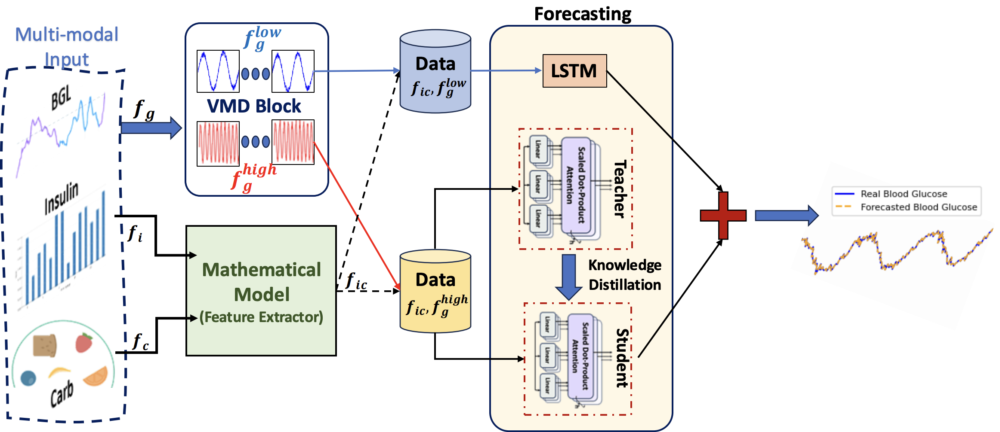

# *GlucoNet: Hybrid Attention Model Using Feature Decomposition and Knowledge Distillation for Blood Glucose Forecasting*

by
***Ebrahim Farahmand, Shovito Barua Soumma, Nooshin Taheri Chatrudi, Hassan Ghasemzadeh***
---

### `We will release the full codebase and the preprocessed dataset after the review process.`

```
pip3 freeze > requirements.txt
```


## Table of Contents
- [To Cite This Work](#to-cite-this-work)
- [Abstract](#abstract)
- [Getting the Code](#getting-the-code)
- [Running the Code](#running-the-code)
  - [Requirements](#requirements)
  - [Setup Environment](#setup-environment)
  - [Reproducing the Results](#reproducing-the-results)


## To Cite This Work
```
@misc{sbsGlueconet,
      title={Hybrid Attention Model Using Feature Decomposition and Knowledge Distillation for Glucose Forecasting}, 
      author={Ebrahim Farahmand and Shovito Barua Soumma and Nooshin Taheri Chatrudi and Hassan Ghasemzadeh},
      year={2024},
      eprint={2411.10703},
      archivePrefix={arXiv},
      primaryClass={cs.LG},
      url={https://arxiv.org/abs/2411.10703}, 
}
```


## Abstract
The availability of continuous glucose monitors (CGMs) as over-the-counter commodities have created a unique opportunity to monitor a person’s blood glucose levels, forecast blood glucose trajectories, and provide automated interventions to prevent devastating chronic complications that
arise from poor glucose control. However, forecasting blood glucose levels (BGL) is challenging because blood glucose  changes consistently in response to food intake, medication  intake, physical activity, sleep, and stress. It is particularly
difficult to accurately predict BGL from multimodal and irregularly sampled data and over long prediction horizons.
Furthermore, these forecasting models need to operate in real-time on edge devices to provide in-the-moment interventions.  To address these challenges, we propose ***GlucoNet***, an AI-powered sensor system for continuous monitoring
of behavioral and physiological health and robust forecasting of blood glucose patterns. GlucoNet devises a feature
decomposition-based lightweight transformer model that incorporates patients’ behavioral and physiological data (e.g.,
blood glucose, diet, medication) and transforms sparse and  irregular patient data (e.g., diet and medication intake data) into continuous features using a mathematical model, facilitating better integration with the BGL data. Given the
non-linear and non-stationary nature of blood glucose signals, we propose a decomposition method to extract both
low-frequency (long-term) and high-frequency (short-term) components from the BGL signals, thus providing accurate forecasting. To reduce the computational complexity of
transformer-based predictions, we propose to employ knowledge distillation (KD) to compress the transformer model.
Our extensive analysis using real patient data shows that, compared to existing models, GlucoNet achieves a 60% improvement in RMSE and a 21% reduction in the number
of parameters while improving mean RMSE and MAE by  51% and 57%, respectively, using data obtained involving
12 participants with type-1 diabetes. These results underscore GlucoNet’s potential as a compact and reliable tool for
real-world diabetes prevention and management.

## Getting the code

You can download a copy of all the files in this repository by cloning the
[git](https://github.com/anonymous/GlucoNet) repository:
  ```
    git clone git@github.com:anonymous/GlucoNet.git
  ```
or [download a zip archive](https://github.com/anonymous/GlucoNet/archive/master.zip).

# Running the code

-----
## Requirements
We use `conda` virtual environments to manage the project dependencies in
isolation.
Thus, you can install our dependencies without causing conflicts with your
setup (even with different Python versions).

Run the following command in the repository folder (where `main.py`
is located) to create a separate environment and install all required
dependencies in it:
    
    conda env create

[//]: # (## Reproducing the results)
## Setup Environment
Before running any code you must activate the conda environment:
    
    source activate ENVIRONMENT_NAME

or, if you're on Windows:

    activate ENVIRONMENT_NAME
**if you are on Windows/Linux:** To install the necessary dependencies, you can use the provided `requirements.txt` file. Run the following command:

    pip install -r requirements.txt
**if you are on Macos**: Use `requirements-macos.txt` file (inside `/code` directory)  to install the dependencies

    pip install -r requirements-macos.txt

----
## Reproducing the Results/ How To Run The Code
1. **Download the dataset**:
   Download the zip data file and unzip it into a folder named `dataset`. This `dataset` folder should be in the same location as the `code` directory.
   _We have used OhioT1DM Dataset and preprocessed dataset (csv format) is avaialble to the reviewers._

2. From the terminal provide the following command
    ```
    python main.py 
    ```
    * After running the above command, the output will be stored in the `output` folder

### Running the code for inference

Goto the `inference` directory and run the following command

    python inferenceKD.py


# Contact
>For any questions or issues, please contact 
* ***Ebrahim Farahmand*** at [efarahma@asu.edu](efarahma@asu.edu)
* ***[Shovito Barua Soumma](https://www.shovitobarua.com)*** at [shovito@asu.edu](shovito@asu.edu) or 
* ***Nooshin Taheri Chatrudi*** at [ntaheric@asu.edu](ntaheric@asu.edu)


[](LICENSE)
